# 🎬 Star Wars GRUB2 Theme Gallery

This is the complete archive of all 15 available themes in the collection.

---

### Theme 01 — Tatooine Sunset
> *"Choose Your Path"*
> A cloaked figure gazes at the twin suns of Tatooine. Warm amber/gold menu positioned to the right of the figure.

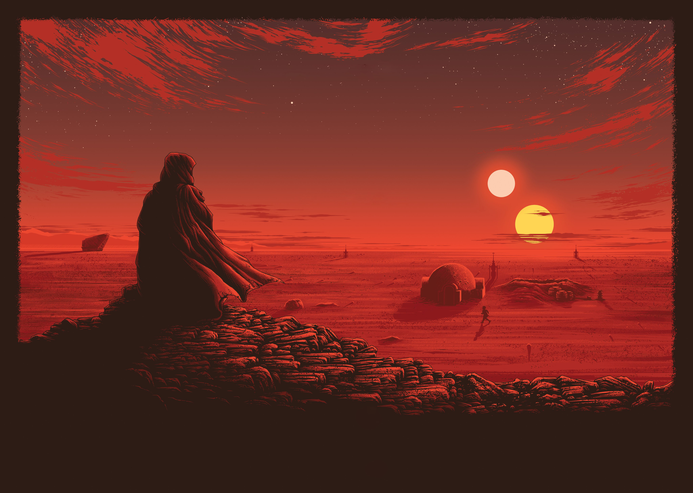

---

### Theme 02 — A New Hope
> *"A New Hope"*
> Classic original trilogy poster art with characters and Death Stars. Blue/gold menu on the left.

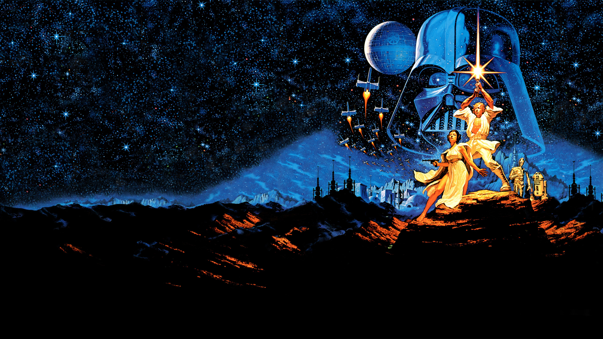

---

### Theme 03 — Imperial Remnants
> *"Imperial Remnants"*
> Crashed TIE fighters in a misty, haunting graveyard landscape. Cold grey/blue palette.

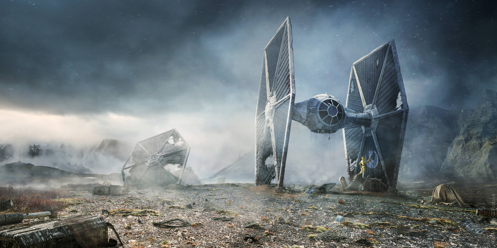

---

### Theme 04 — The Force Awakens
> *"The Force Awakens"*
> Beautiful four-panel art: blue forest, orange desert, green lake, red fire. Centered warm-neutral menu.

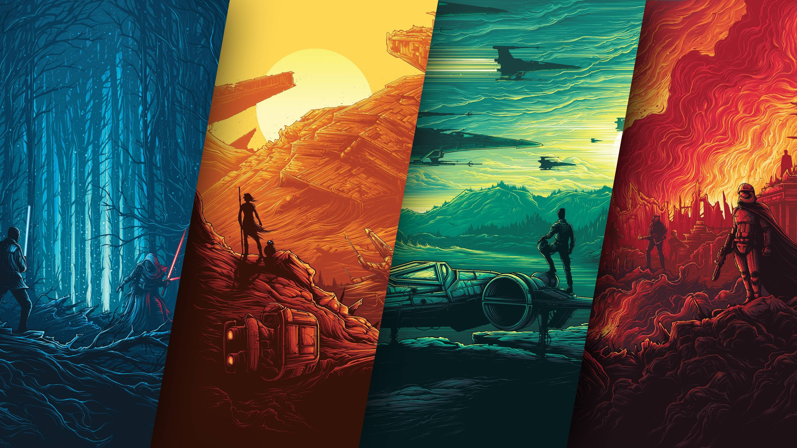

---

### Theme 05 — Battle of Bespin
> *"Battle of Bespin"*
> Epic aerial battle with the Millennium Falcon and X-Wings over Cloud City. Golden palette.

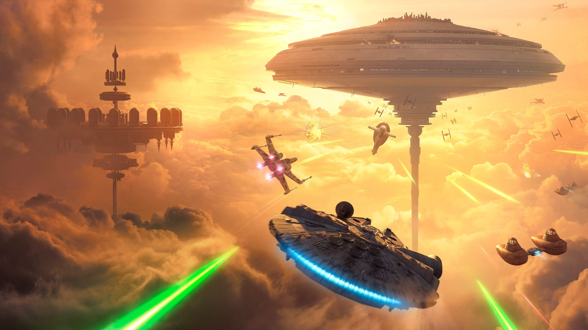

---

### Theme 06 — The Kessel Run
> *"The Kessel Run"*
> Millennium Falcon soaring over a desert landscape at sunset with twin suns. Sandy warm tones.

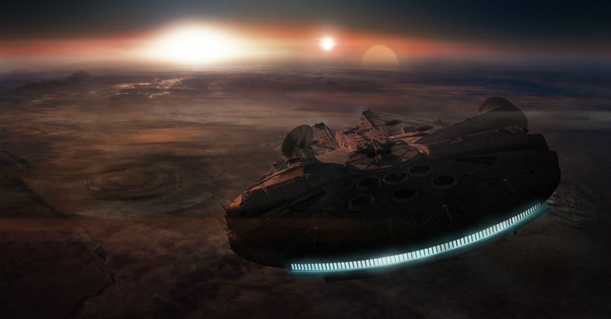

---

### Theme 07 — The Dark Side
> *"The Dark Side"*
> Iconic Darth Vader profile portrait in a cold blue-black atmosphere. Red accent for selected items.

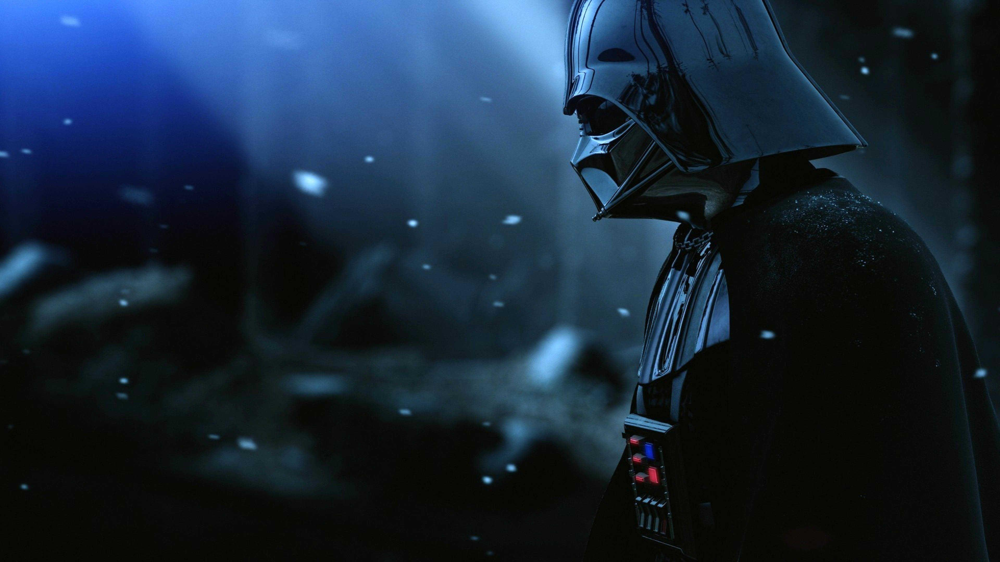

---

### Theme 08 — A Galaxy Far Away
> *"A Galaxy Far Away"*
> The ultimate celebration — every Star Wars character in one epic group photo. Purple/blue palette with firework orange.

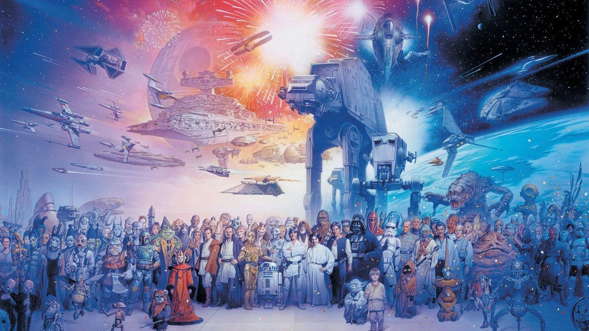

---

### Theme 09 — Red Squadron
> *"Red Squadron"*
> X-Wing fighters in formation painted against a dramatic sunset sky. Warm brown/gold tones.

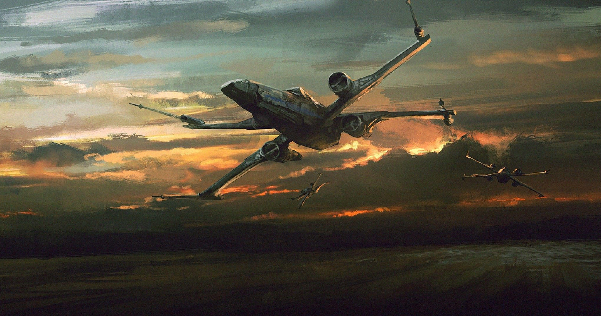

---

### Theme 10 — That's No Moon
> *"That's No Moon"*
> The massive Death Star II rising over a blue night sky with AT-AT silhouettes. Deep blue monochrome.

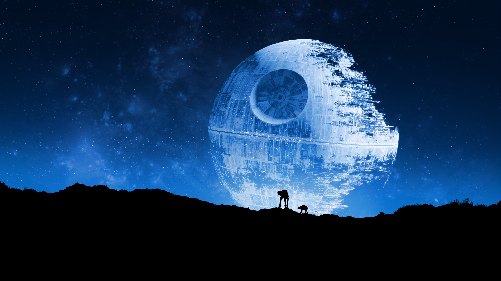

---

### Theme 11 — Ultimate Power
> *"Ultimate Power"*
> The classic Death Star floating in the stark void of space. Minimal grey/monochrome aesthetic.

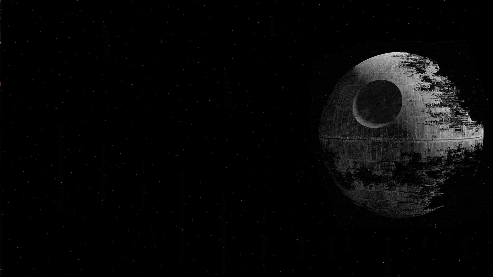

---

### Theme 12 — You Were The Chosen One
> *"You Were The Chosen One"*
> The legendary Obi-Wan vs Anakin lightsaber duel on the volcanic world of Mustafar. Intense red/orange/gold.

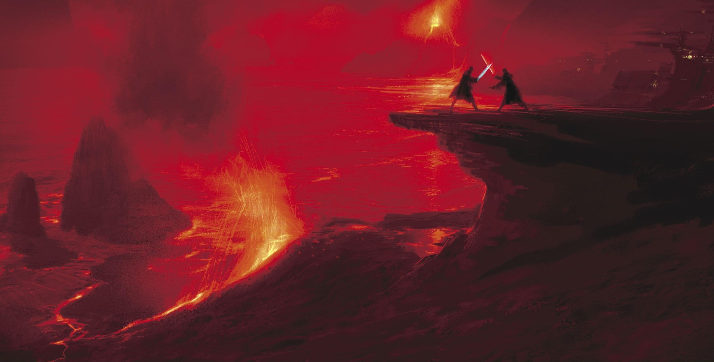

---

### Theme 13 — Punch It, Chewie!
> *"Punch It, Chewie!"*
> Millennium Falcon cruising through the dark void of deep space. Subtle cool tones with cyan engine glow.

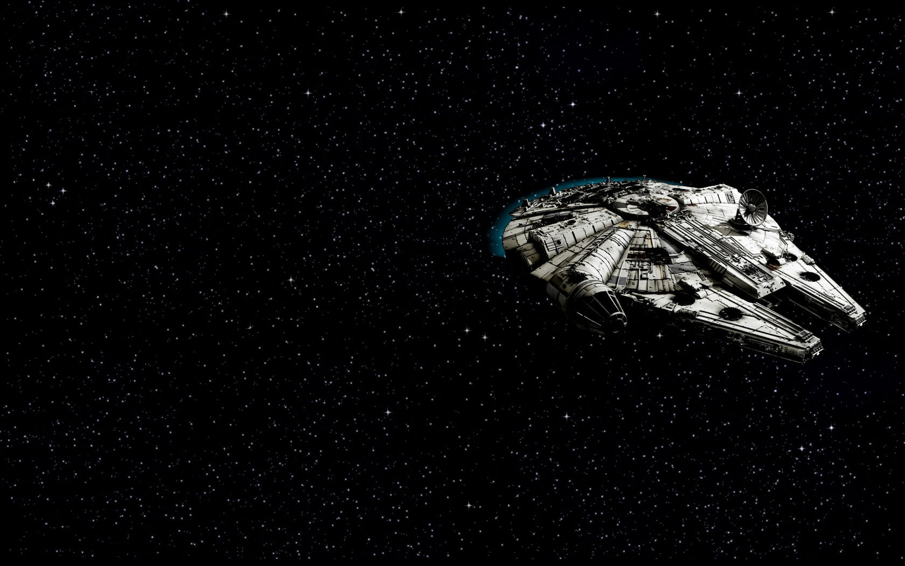

---

### Theme 14 — Orbital Approach
> *"Orbital Approach"*
> Millennium Falcon descending into the atmosphere of a desert planet from orbit. Orange/brown with cyan accents.

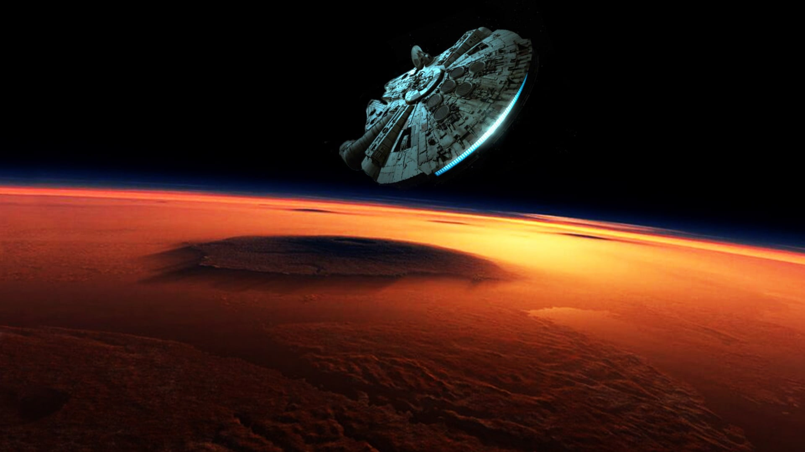

---

### Theme 15 — Do or Do Not
> *"Do or Do Not"*
> Master Yoda in the Dagobah swamp, wise and powerful. Green/olive palette matching the swamp environment.

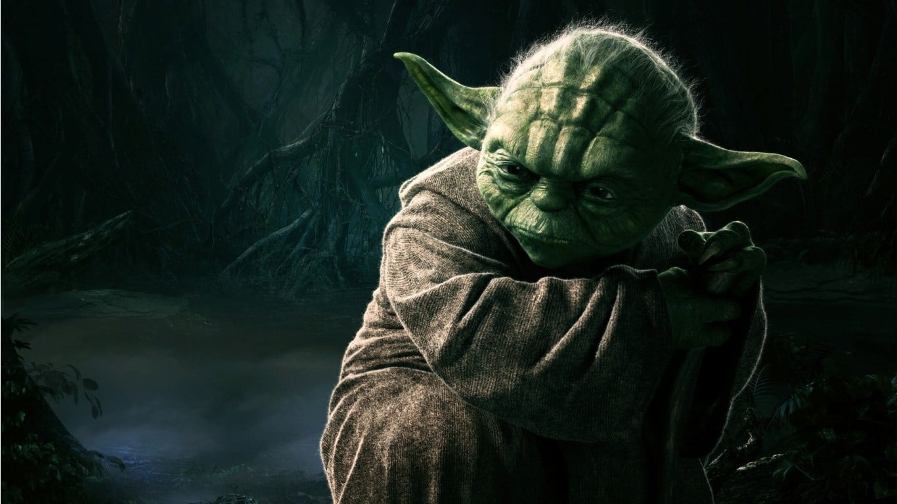

---

  <a href="README.md">← Back to README</a>

